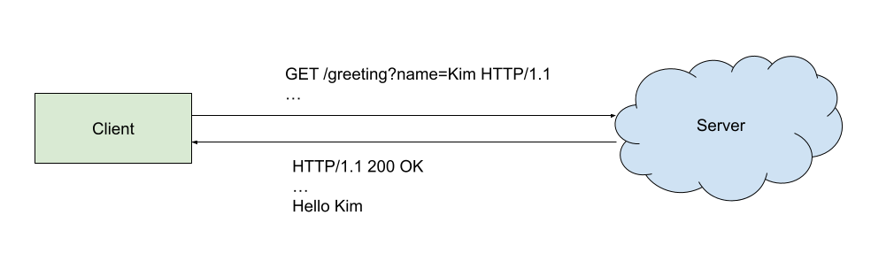
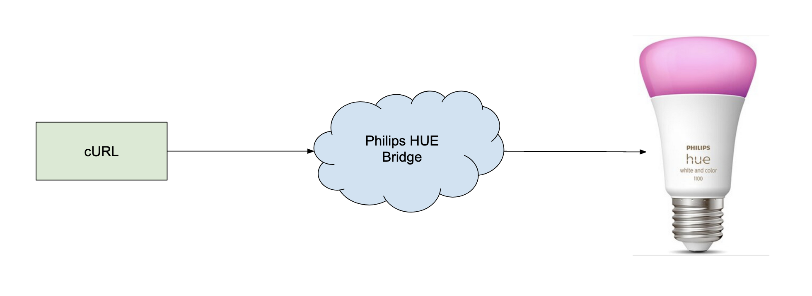
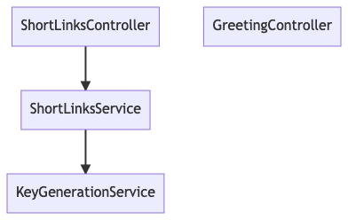
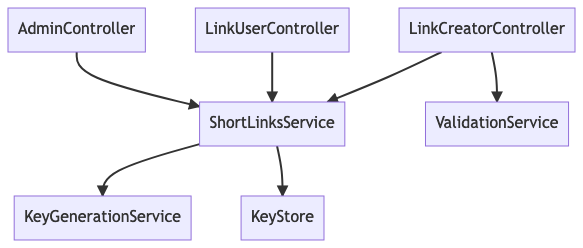

# Logic, service layer, dependency injection

----

## Where are we at?

* We want to build URL shorter service (class 1)
* We know how to build simple Spring Boot application (class 2)

----

## Agenda for today
* We will make a first implementation of our URL shortener service (MVP)
* We will apply service layer pattern to organise our code
* We will use dependency injection to reduce the boilerplate

----

## Core functionality

* As a link creator I would like to create a short link for my long URL
* As a link user I would like to be redirected to the original URL by following a short link

Read more about [user stories](https://en.wikipedia.org/wiki/User_story).

----

## HTTP



----

## Clients

* Browsers, ???

----

## Servers
* Web services, ???

----

## Type of HTTP requests:
* GET – obtain resource from the server
* POST – create a new resource on the server
* PUT – update resource on the server
* DELETE – delete resource from the server

----

### Curl

Command line HTTP client.

To send GET request:
```
curl http://localhost:8080/greeting
```

----

## Philips HUE Live Demo

Get info about my lamp:
```
curl http://192.168.0.189/api/DKOQwxk5PN0BE5ZVBcANlnXFLXdk-uR8KGNzEup4/lights/11
```

Update my lamp state
```
curl -X PUT http://192.168.0.189/api/DKOQwxk5PN0BE5ZVBcANlnXFLXdk-uR8KGNzEup4/lights/11/state --data '{"on": true}'
```



---

## Simple API

### Create short link
```
curl -X POST http://localhost:8080/links --data '{"url": "http://example.org"}'
```

Response:
```
{ "url": "http://localhost:8080/xxx" }
```

----

### Expand short link
```
curl http://localhost:8080/xxx -v
```

Response:
```
< HTTP/1.1 301 
< Location: http://example.com
```

----

## Let's add ShortLinksController

Code:

```
git switch short-links-controller
```

----

## Our code structure

* Model, domain classes – model our application data
* Controllers – handle incoming HTTP requests, perform business logic

----

## Service layer

Let's separate business logic into its own *service layer*.


*from Martin Fowler [post](https://martinfowler.com/eaaCatalog/serviceLayer.html).

----

## Let's add ShortLinksService and KeyGenerationService

Code:

```
git switch services
```

----

## Main benefits

* Clear separation of concerns
* We can change representation layer (or framework) without touch the business logic
* Simplifies testing

----

## Let's add ShortLinksService and KeyGenerationService

Code:

```
git switch services
```

----

## Main benefits

* Clear separation of concerns
* Simplifies testing

----

## Dependency injection

Automatically instantiate components for us.

---
## Main benefits

* No more boilerplate
* Decouples components

----

Code:

```
git switch dependency-injection
```

----

## Dependency graph



----




----

## Home assignment
* Create delete link endpoint
* Bonus: Create test for `expandShortLink()`
* Bonus: Implement key generation service
* Bonus: Ensure that `ShortLinksService` can handle key coalition, think about thread safety